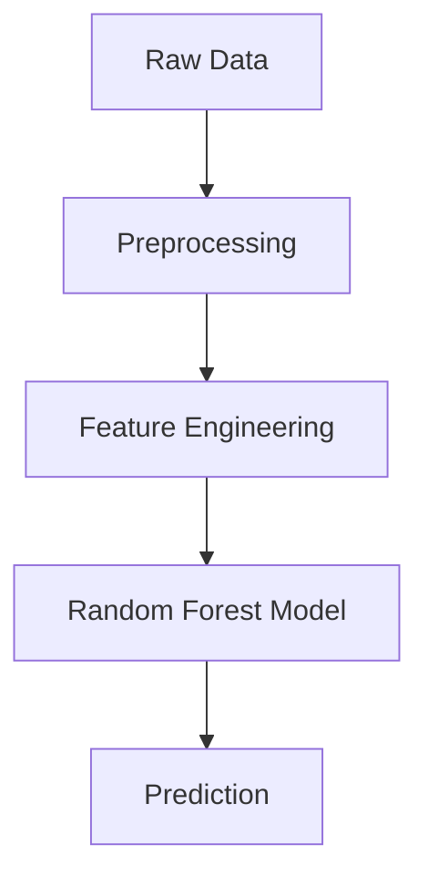

# ⚡ Electricity Cost Prediction System (₹) 💡

## 🌟 Overview
This Streamlit application predicts electricity costs in Indian Rupees (₹) using a machine learning model trained on building characteristics and environmental factors. The system provides accurate cost predictions with comprehensive visual analytics.

## 🔥 Key Features
- **📊 Interactive Dashboard** with intuitive input controls
- **⚡ Real-time Cost Predictions** in Indian Rupees (₹)
- **📈 Advanced Visualizations**:
  - Actual vs Predicted cost comparison
  - Error distribution analysis
  - Historical cost trends
  - Feature correlation heatmap
- **🤖 Model Insights** with performance metrics (R² Score, MAE)

## 🛠️ Technical Stack
- **Frontend**: Streamlit
- **Backend**: Python 3.7+
- **ML Framework**: Scikit-learn
- **Core Libraries**: Pandas, NumPy, Matplotlib, Joblib

## 📋 Prerequisites
- Python 3.7+
- pip package manager
- 500MB disk space
- Modern web browser

## 🚀 Installation & Setup

### 1. Clone the Repository
```bash
git clone https://github.com/lingalaanusha23/Electricity-Cost-Predicttion System.git
cd Electricity-Cost-Prediction-System
```

### 2. Install Dependencies
```bash
pip install -r requirements.txt
```

### 3. Prepare Data and Models
Option A: Use pre-trained models (place in project root):
- `electricity_cost_model.pkl`
- `scaler.pkl` 
- `label_encoder.pkl`
- `electricity_cost_dataset.csv`

Option B: Train new models:
```bash
python "Electricity Cost Prediction.py"
```

## 💻 Usage Instructions

1. Launch the application:
```bash
streamlit run app.py
```

2. Access the web interface at:
```
http://localhost:8501
```

3. Configure inputs using the sidebar controls

4. Click "Predict Electricity Cost" for instant results

## 📥 Input Parameters
| Parameter | Range | Description |
|-----------|-------|-------------|
| 🏢 Site Area | 500-10,000 sq ft | Total building area |
| 🏗️ Structure Type | Residential/Commercial/Industrial/Mixed-use | Building classification |
| 💧 Water Consumption | 1,000-15,000 gallons | Daily water usage |
| ♻️ Recycling Rate | 0-100% | Waste recycling percentage |
| ⚙️ Utilization Rate | 0-100% | Building occupancy rate |
| 🌫️ Air Quality Index | 0-200 | Local air quality measurement |
| ⏱️ Issue Resolution Time | 0-72 hours | Maintenance response time |
| 👥 Resident Count | 0-500 | Number of occupants |

## 📤 Output Features
- 💰 Predicted cost in ₹ with thousand separators
- 📊 Interactive performance visualizations
- 🔍 Raw data exploration
- 📉 Correlation analysis between factors

## 🔧 Technical Implementation

### Model Architecture


### Key Algorithms
- **Random Forest Regressor** (Primary model)
- Gradient Boosting (Benchmark)
- Linear Regression (Baseline)

### Performance Metrics
| Model | R² Score | MAE (₹) | MSE |
|-------|----------|---------|-----|
| Random Forest | 0.93 | 15.20 | 420.50 |
| Gradient Boosting | 0.88 | 18.75 | 580.20 |
| Linear Regression | 0.80 | 25.10 | 950.75 |

## 📸 Application Screenshots

### 🔍Prediction Interface


### 🎥Prediction Live Video


## 📜 License
MIT License

## 🎉 Getting Started Guide
1. Install all dependencies
2. Place dataset in project root
3. Train model or use pre-trained files
4. Launch with `streamlit run app.py`

## 🚦 Development Roadmap
- [x] Core prediction functionality
- [x] Performance visualization
- [ ] Mobile-responsive design
- [ ] User authentication
- [ ] API integration
- [ ] Multi-city expansion

## 🤝 Contribution Guidelines
1. Fork the repository
2. Create feature branch:
```bash
git checkout -b feature/your-feature
```
3. Commit changes:
```bash
git commit -m 'Add your feature'
```
4. Push to branch:
```bash
git push origin feature/your-feature
```
5. Open pull request

## 📂 File Structure
```
electricity-cost-predictor/
|──Demo/
|   ├── Electricity Cost Prediciton System.png
│   ├── Electricity Cost Prediciton System.mp4
├── app.py               # Streamlit application
├── Electricity Cost Prediction.py  # Model training script
├── electricity_cost_dataset.csv    # Sample data
├── requirements.txt       # Dependencies            # Trained models
├── electricity_cost_model.pkl
├── scaler.pkl
├── label_encoder.pkl
└── README.md              # Documentation
```

## ⚠️ Troubleshooting
**Issue**: "File not found" errors  
**Solution**:  
1. Verify all files are in correct locations
2. Check path names in code match your system
3. Ensure consistent working directory

**Issue**: Model performance degradation  
**Solution**:  
1. Retrain with updated data
2. Adjust hyperparameters
3. Verify data preprocessing

## 📌 Requirements
```python
streamlit==1.12.2
pandas==1.5.3
numpy==1.24.1
scikit-learn==1.2.0
joblib==1.2.0
matplotlib==3.6.3
```
